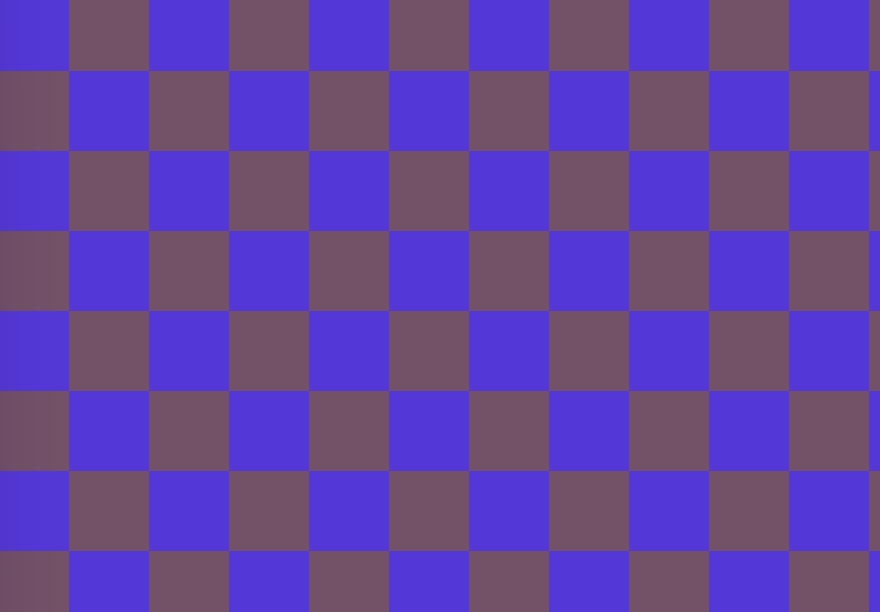
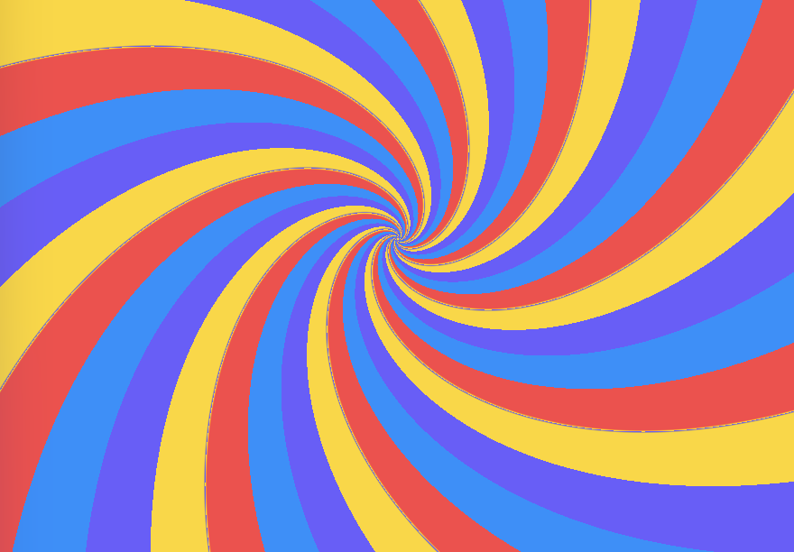
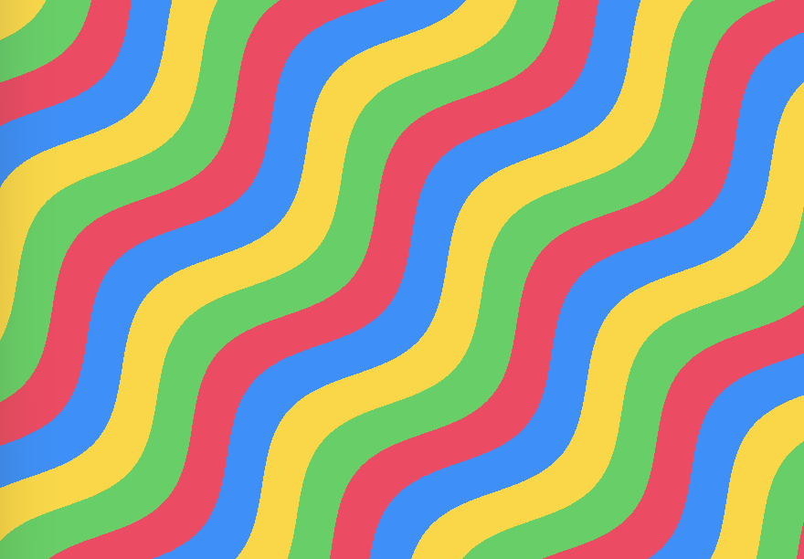
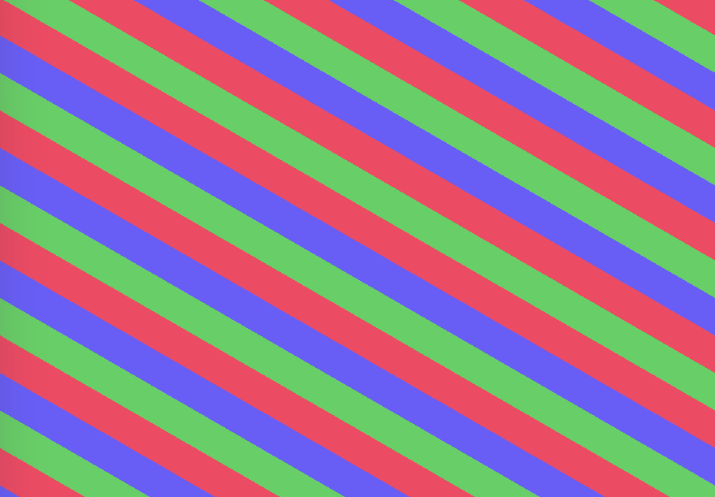
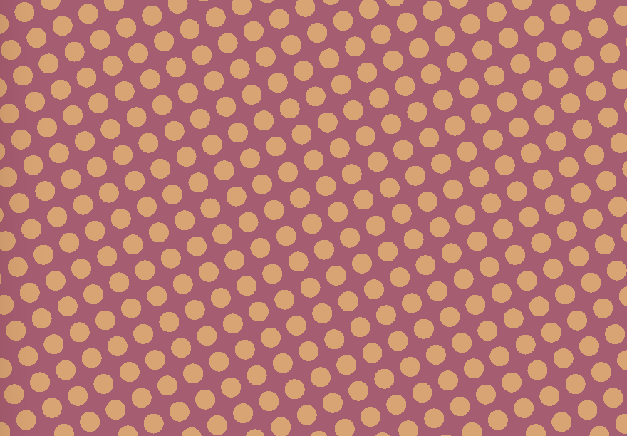
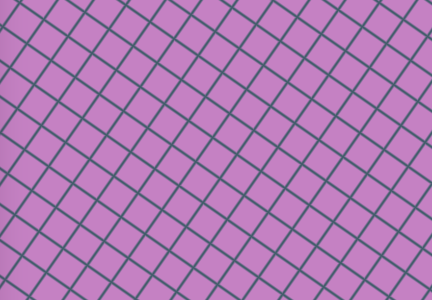
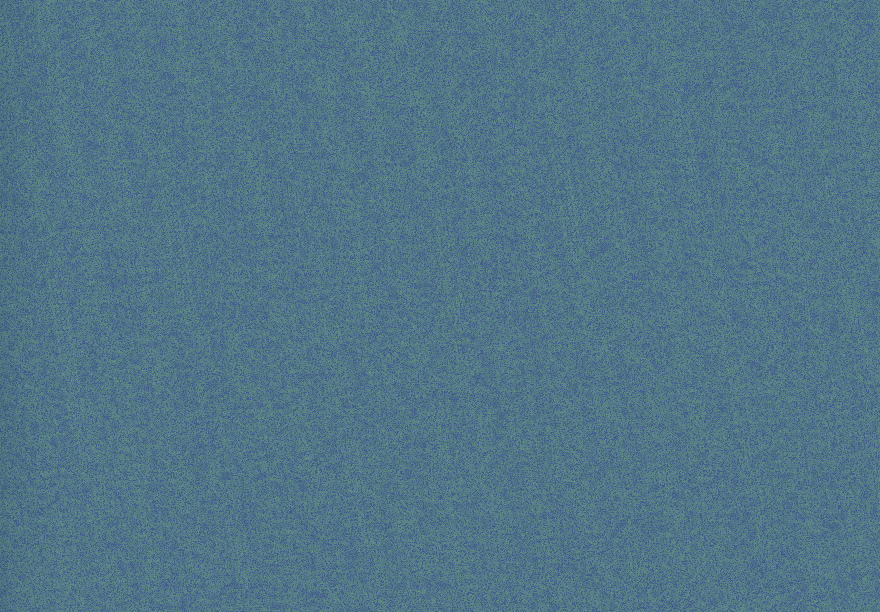

# ShadyGround

A Swift Package for Beautiful Metal Shader patterns in SwiftUI

ShadyGround provides a collection of high-performance Metal patterns for SwiftUI, with a consistent API and built-in preview capabilities. Perfect for creating stunning backgrounds and visual effects in your iOS and macOS apps.

## Installation

### Swift Package Manager

Add ShadyGround to your project using Swift Package Manager:

```swift
dependencies: [
    .package(url: "https://github.com/mikebedar/ShadyGround.git", from: "1.0.0")
]
```

## Quick Start

```swift
import ShadyGround

struct ContentView: View {
    var body: some View {
        VStack(spacing: 20) {
            // Simple checkerboard pattern
            CheckerboardBackground(
                cellSize: 16,
                backgroundColor: .blue.opacity(0.1),
                foregroundColor: .blue.opacity(0.3)
            )
            .frame(width: 200, height: 200)
            
            // Dynamic spiral with color palette
            SpiralBackground(
                stripesPerTurn: 6,
                twist: 2.0,
                colors: [.purple, .pink, .orange, .yellow, .green, .blue]
            )
            .frame(width: 200, height: 200)
            
            // Wave pattern with multiple colors
            WaveBackground(
                amplitude: 20,
                frequency: 0.1,
                colors: [.cyan, .blue, .purple, .pink]
            )
            .frame(width: 200, height: 200)
        }
    }
}
```

## Available Effects

ShadyGround includes 7 beautiful shader effects, each with customizable parameters. Three effects (Spiral, Stripe, Wave) support rich color palettes with 2-8 colors:

### Checkerboard Pattern
A classic alternating square pattern with rotation support.



```swift
CheckerboardBackground(
    cellSize: 16,           // Size of each square
    angle: .pi / 4,         // Rotation angle in radians
    backgroundColor: .blue.opacity(0.3),
    foregroundColor: .purple.opacity(0.1)
)
```

### Spiral Pattern
Dynamic spiral stripes with customizable twist and color palette. Supports 2-8 colors for stunning visual effects.



```swift
SpiralBackground(
    stripesPerTurn: 8.0,    // Number of color bands per rotation
    twist: 1.0,             // Logarithmic spiral twist factor
    centerOffsetPx: .zero,  // Offset from center in pixels
    colors: [.red, .orange, .yellow, .green, .blue, .purple]  // 2-8 colors
)
```

### Wave Pattern
Smooth wave-like stripes with amplitude and frequency control. Supports 2-8 colors for rich, dynamic patterns.



```swift
WaveBackground(
    amplitude: 20,          // Height of wave peaks
    frequency: 0.1,         // How many waves across the pattern
    foregroundStripeWidth: 25,
    phase: 0,               // Wave offset
    angle: 0,               // Rotation angle in radians
    colors: [.blue, .cyan, .purple, .pink]  // 2-8 colors
)
```

### Diagonal Stripes
Clean diagonal stripes with customizable width and angle. Supports 2-8 colors for vibrant patterns.



```swift
StripeBackground(
    stripeWidth: 20,        // Width of each stripe
    angle: .pi / 4,         // Rotation angle in radians
    colors: [.green, .orange, .yellow, .red]  // 2-8 colors
)
```

### Polka Dots
Circular dots arranged in a grid pattern.



```swift
DotsBackground(
    dotSize: 8,             // Diameter of each dot
    spacing: 20,            // Distance between dot centers
    angle: 0,               // Rotation angle in radians
    backgroundColor: .white.opacity(0.1),
    foregroundColor: .red.opacity(0.3)
)
```

### Grid Pattern
Clean grid lines with customizable spacing and line width.



```swift
GridBackground(
    spacing: 20,            // Distance between grid lines
    lineWidth: 1,           // Thickness of grid lines
    angle: 0,               // Rotation angle in radians
    backgroundColor: .clear,
    foregroundColor: .gray.opacity(0.2)
)
```

### Noise Pattern
TV-static style noise with fractal properties and customizable intensity.



```swift
NoiseBackground(
    scale: 1.0,             // Overall noise scale
    intensity: 1.0,         // Noise visibility (0-1)
    octaves: 4,             // Number of noise layers
    persistence: 0.5,       // How much each octave contributes
    seed: 0,                // Random seed for variation
    angle: 0,               // Rotation angle in radians
    backgroundColor: .clear,
    foregroundColor: .gray.opacity(0.8)
)
```

## Time-Based Animation
Example of an animated use case with `AnimatedSpiralBackground`:

```swift
// Automatically animates the spiral twist over time
AnimatedSpiralBackground(
    stripesPerTurn: 8,
    baseTwist: 1.0,
    twistAmplitude: 2000.0,
    animationSpeed: 0.25,
    colors: [.red, .orange, .yellow, .green, .blue, .purple]
)
```

## Requirements

- iOS 17.0+ / macOS 14.0+
- Swift 6.2+
- Xcode 16.0+

## License

This project is licensed under the MIT License - see the LICENSE file for details.

## Contributing

Contributions are welcome! Please feel free to submit a Pull Request.

## Support

If you encounter any issues or have questions, please open an issue on GitHub.
